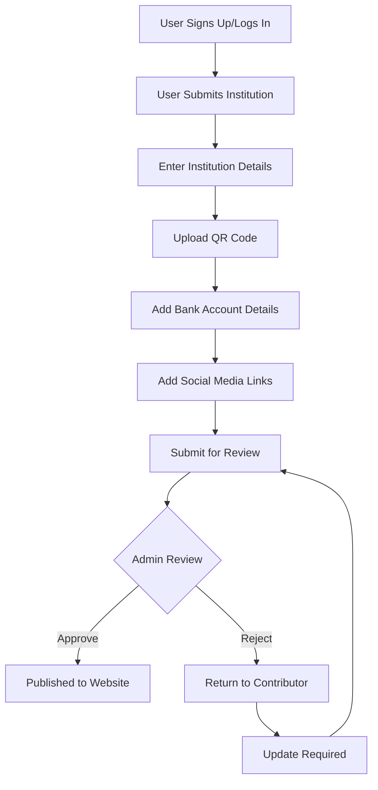

# Sedekah-je System Flow

## Contribution Flow

## Key Tables and Their Purposes

### Core Tables
- `users`: Stores user information and admin status
- `institutions`: Main table for charity/donation centers
- `categories`: Types of institutions (e.g., Mosque, Orphanage)

### Location Tables
- `malaysian_states`: List of states
- `malaysian_cities`: Cities within states

### Payment Tables
- `banks`: Supported banks
- `institution_bank_accounts`: Institution's bank accounts
- `payment_methods`: Available payment methods (e.g., DuitNow, Online Banking)

### Social Media Tables
- `social_platforms`: Supported social media platforms
- `institution_social_links`: Institution's social media presence

## Institution Status Flow

1. **Pending** (Default)
   - When first submitted by contributor
   - Awaiting admin review

2. **Approved**
   - Verified by admin
   - Visible on public website
   - Tracks who approved and when

3. **Rejected**
   - Not suitable/incomplete
   - Includes rejection reason
   - Can be updated and resubmitted

## Required Fields for Institution Submission

### Basic Information
- Name
- Category
- Description
- Location (State/City)
- Address & Postcode
- Contact (Phone/Email)

### Payment Information
- At least one bank account
- QR code (image + content)
- Supported payment methods

### Optional Information
- Social media links
- Additional bank accounts
- Detailed description

## Admin Features
- View all submissions
- Filter by status
- Approve/Reject with comments
- View contributor information
- Audit trail of changes
